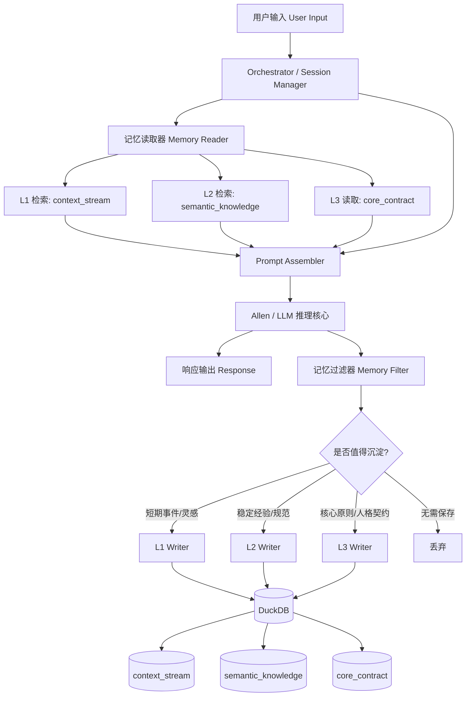
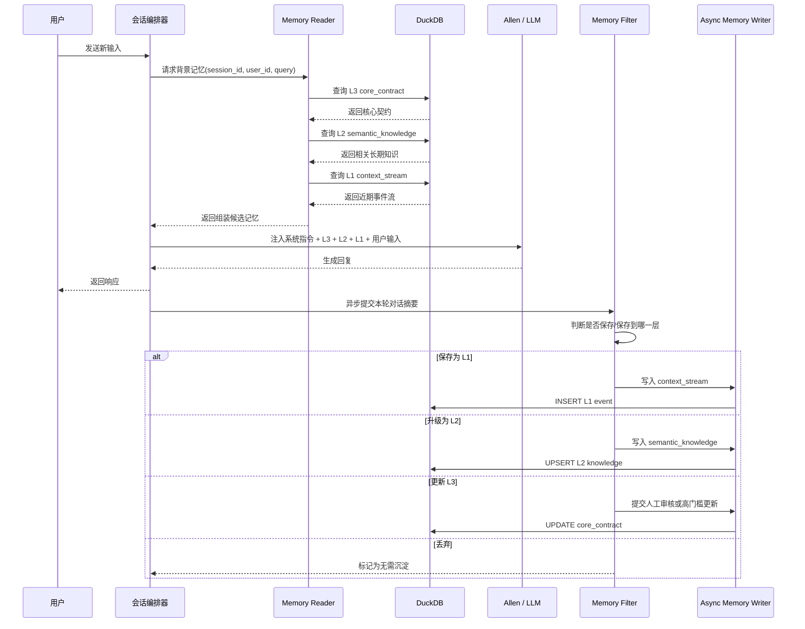

# Project Soul Anchor - 深度架构设计与执行报告

## 0. 文献引用与设计输入 (References & Inputs)

为确保本报告的架构设计具备**可回溯、可审计**的工程属性，现将关键设计输入与理论来源明确列示如下。

### 输入来源 1：MemPalace 源码与文档
- 来源链接：https://github.com/MemPalace/mempalace
- 提取的理论依据：
  - **L0-L3 分层记忆结构设计**：将记忆区分为工作记忆、事件记忆、语义记忆与核心人格/契约层，以支持不同时间尺度与认知职责的分工。
  - **记忆的生命周期与过滤机制**：强调并非所有交互都应被永久保存，而应经过筛选、衰减、升级与治理，避免噪声污染长期记忆。

### 输入来源 2：DB9 产品文档
- 来源链接：https://db9.ai/docs/overview/
- 提取的理论依据：
  - **DB as Mem Service（数据库即记忆服务）**：主张以结构化数据库作为记忆系统的核心承载层。
  - **以 ACID 与 SQL 检索替代传统文本拼接与向量堆叠**：强调记忆对象应具备结构化 schema、可查询性、可治理性与可审计性，而不是仅依赖 prompt 拼接或无结构向量堆积。

### 设计推导溯源 (Audit Trail)
本报告提出的 **DuckDB 本地架构** 并非凭空想象，而是基于以下可追溯推导链条形成：

1. 从 **MemPalace** 吸收“分层心智”理论，将记忆系统拆分为 L0-L3，不同层承担不同认知职责；
2. 从 **DB9** 吸收“结构化记忆服务”实践，将记忆视为可建模、可检索、可治理的数据库对象；
3. 在此基础上，结合本项目对**绝对隐私保护**的要求，放弃云端托管式记忆服务，转而采用**单文件本地数据库（DuckDB）**作为落地载体；
4. 因而，Soul Anchor 的本地 DuckDB 方案，本质上是 **MemPalace 的分层认知理论** 与 **DB9 的结构化工程实践** 在本地隐私场景下的组合推导结果。

---

## 1. 架构愿景与溯源

Project Soul Anchor 的目标，不是简单为对话系统增加一个“聊天记录存档”模块，而是为智能体构建一套**可演化、可检索、可约束、可沉淀**的记忆基础设施，使 Allen 不再只依赖单轮上下文窗口，而是具备跨会话、跨阶段、跨任务的连续认知能力。

这一设计思路主要溯源于两类关键理念：

### 1.1 MemPalace：分层记忆不是“存更多”，而是“分层处理不同认知职责”

MemPalace 的核心启发在于：**记忆系统不应被视为单一向量库或单一日志表，而应被视为具有不同时间尺度、不同抽象层级、不同可信度的多层认知结构。**

在这一视角下，记忆并不是“把所有对话都塞进数据库”，而是要回答以下问题：

- 哪些信息只在当前对话中有价值？
- 哪些信息应该保留几小时到几天，作为近期情境？
- 哪些信息已经足够稳定，可以上升为长期知识？
- 哪些信息属于人格边界、价值观、系统契约，必须以最高优先级约束模型行为？

因此，MemPalace 的 L0-L3 分层可以理解为：

- **L0：Working Memory** —— 当前推理现场，依赖大模型上下文窗口，速度最快，但天然易失。
- **L1：Episodic Memory** —— 近期事件流，保留“发生过什么”，强调时间顺序与上下文片段。
- **L2：Semantic Memory** —— 从事件中提炼出的稳定知识，强调“总结后的可复用认知”。
- **L3：Core Persona / Core Contract** —— 最高优先级的身份、原则、边界与不可违背约束。

这套分层的价值在于，它把“记忆”从单一存储问题，提升为**认知分工问题**：

1. **L0 负责即时推理效率**；
2. **L1 负责保留近期上下文连续性**；
3. **L2 负责知识沉淀与长期复用**；
4. **L3 负责人格稳定性与系统安全边界**。

对于 Soul Anchor 而言，这意味着 Allen 的“自我连续性”不再依赖 prompt 拼接技巧，而是依赖一套明确的记忆分层协议。

### 1.2 DB9：DB as Memory Service，不再依赖脆弱的文本拼接

DB9 的关键思想是：**数据库不是对话系统的附属品，而应成为 Memory Service 的核心承载层。**

传统做法常见问题包括：

- 把历史对话直接拼接进 prompt，导致 token 成本线性上升；
- 记忆检索结果缺乏结构化字段，难以做优先级排序；
- 长期知识、短期事件、系统规则混在一起，召回噪声极高；
- 无法对记忆进行版本化、审计、过期、归档与治理。

DB9 的启发在于：**用结构化存储替代“纯文本堆叠”，让记忆具备数据库级别的可管理性。**

这意味着：

- 记忆对象应有明确 schema；
- 不同层级记忆应有不同表结构与生命周期；
- 检索不只是“相似度搜索”，还应结合时间、来源、权重、标签、置信度；
- 写入不应是无差别落库，而应经过过滤、摘要、归类、升级；
- 读取不应是全量回放，而应是按任务意图进行路由与组装。

在 Soul Anchor 中，DuckDB 被选为早期 Memory Service 的核心载体，原因包括：

- **嵌入式、零运维**：适合 MVP 快速落地；
- **SQL 能力强**：便于做结构化查询、聚合、过滤与分析；
- **适合本地智能体架构**：无需先引入复杂分布式依赖；
- **支持 FTS / 扩展能力**：可逐步演进到更强检索能力；
- **便于 Python 集成**：适合 Allen 的工具链与异步记忆管线。

因此，Project Soul Anchor 的基础架构原则可以概括为：

> **以 MemPalace 的分层认知模型定义“记忆应该如何分工”，以 DB9 的结构化数据库思路定义“记忆应该如何落地”。**

最终目标不是“让 Allen 记住更多”，而是让 Allen：

- 在需要时记得起；
- 在不需要时不干扰；
- 在长期运行中逐步形成稳定知识；
- 在关键边界上始终保持一致人格与行为约束。

---

## 2. Soul Anchor 记忆流转架构 (Mermaid)

下面的架构图描述了从用户输入进入 Allen，到记忆过滤、路由、再到 DuckDB 中 L1-L3 分层存储的核心链路。



### 2.1 架构解读

该架构并非“先查库再回答”这么简单，而是一个**双向闭环**：

#### 读路径（Read Path）
1. 用户输入首先进入会话编排层（Orchestrator / Session Manager）。
2. 编排层根据当前任务、用户身份、会话主题触发记忆读取器。
3. 读取器分别从：
   - **L1** 拉取近期相关事件；
   - **L2** 拉取稳定知识与经验；
   - **L3** 拉取最高优先级的人格契约与行为边界。
4. Prompt Assembler 将这些结构化记忆压缩、排序、拼装为 Allen 可消费的上下文。
5. Allen 在 L0 工作记忆中完成推理并生成响应。

#### 写路径（Write Path）
1. Allen 输出后，不直接把整段对话原样入库。
2. 记忆过滤器对本轮交互进行评估：
   - 是否只是一次性噪声？
   - 是否是近期值得保留的事件？
   - 是否已经形成可复用知识？
   - 是否触及核心人格或系统契约？
3. 根据分类结果，写入不同层级表。
4. 未来对话再通过检索回流，形成“对话—沉淀—再利用”的闭环。

### 2.2 关键设计原则

- **先分层，再存储**：避免所有记忆进入同一表造成污染。
- **先过滤，再写入**：避免把噪声当知识。
- **先检索，再组装**：避免无差别拼接历史文本。
- **L3 优先级最高**：任何召回内容都不能覆盖核心契约。
- **L1 可衰减，L2 可升级，L3 极度谨慎变更**：体现不同层级的治理策略。

---

## 3. L0 - L3 分层设计与 DuckDB Schema Demo

本节从认知职责、数据结构、读写策略三个维度，详细说明 Soul Anchor 的四层记忆设计。

### 3.1 L0 瞬时记忆 (Working Memory)

L0 并不直接落在 DuckDB 中，它是 Allen 在当前推理时刻所持有的**原生上下文窗口**。其本质是：

- 当前用户输入；
- 当前系统指令；
- 本轮召回的 L1/L2/L3 记忆摘要；
- 当前工具调用结果；
- 当前推理链路中的中间状态。

#### L0 的特点

- **速度最快**：无需 IO，直接在模型上下文中使用；
- **容量最贵**：受 token window 限制；
- **生命周期最短**：一次推理结束后即失效；
- **最适合承载“当前问题”而非“长期记忆”**。

#### L0 的设计原则

1. L0 只保留当前任务真正需要的信息；
2. L0 不承担长期存储职责；
3. L0 的内容应由 Memory Reader 动态组装，而不是静态堆叠；
4. L0 中的 L3 约束必须始终位于高优先级位置。

可以把 L0 理解为 Allen 的“意识前台”，而 DuckDB 中的 L1-L3 则是“意识后台”。

---

### 3.2 L1 短期流 (Episodic Memory)

L1 用于记录**近期发生过的对话切片、任务片段、灵感、上下文事件**。它强调的是“发生过什么”，而不是“总结出了什么”。

典型内容包括：

- 用户最近几轮表达的目标与偏好；
- 某次任务中的中间决策；
- 一次尚未稳定成知识的灵感；
- 某个会话中的临时约束；
- 近期待跟进事项。

L1 的核心表命名为：`context_stream`。

#### 3.2.1 DuckDB Schema Demo：context_stream

```sql
CREATE SEQUENCE IF NOT EXISTS seq_context_stream START 1;

CREATE TABLE IF NOT EXISTS context_stream (
    id BIGINT PRIMARY KEY DEFAULT nextval('seq_context_stream'),
    session_id VARCHAR NOT NULL,
    user_id VARCHAR NOT NULL,
    topic VARCHAR,
    event_type VARCHAR NOT NULL,
    content TEXT NOT NULL,
    summary TEXT,
    tags TEXT,
    importance_score DOUBLE DEFAULT 0.5,
    salience_score DOUBLE DEFAULT 0.5,
    source_turn_id VARCHAR,
    created_at TIMESTAMP DEFAULT CURRENT_TIMESTAMP,
    expires_at TIMESTAMP,
    is_archived BOOLEAN DEFAULT FALSE
);
```

#### 字段设计说明

- `session_id`：标识会话，便于按会话回放近期上下文；
- `user_id`：支持多用户隔离；
- `topic`：便于按主题聚合；
- `event_type`：如 `dialogue_snippet`、`idea`、`task_state`、`preference_signal`；
- `content`：原始事件内容；
- `summary`：对事件的压缩描述，便于快速召回；
- `tags`：轻量标签，可先用逗号分隔，后续可演进为关联表；
- `importance_score`：业务重要性；
- `salience_score`：对当前阶段的显著性；
- `expires_at`：短期记忆天然可过期；
- `is_archived`：归档标记，便于后续清理与升级。

#### 3.2.2 Python 插入 Demo：写入 L1

```python
from __future__ import annotations

import duckdb
from datetime import datetime, timedelta

DB_PATH = "./soul_anchor.duckdb"


def insert_context_stream_event() -> None:
    conn = duckdb.connect(DB_PATH)
    conn.execute(
        """
        CREATE SEQUENCE IF NOT EXISTS seq_context_stream START 1;
        CREATE TABLE IF NOT EXISTS context_stream (
            id BIGINT PRIMARY KEY DEFAULT nextval('seq_context_stream'),
            session_id VARCHAR NOT NULL,
            user_id VARCHAR NOT NULL,
            topic VARCHAR,
            event_type VARCHAR NOT NULL,
            content TEXT NOT NULL,
            summary TEXT,
            tags TEXT,
            importance_score DOUBLE DEFAULT 0.5,
            salience_score DOUBLE DEFAULT 0.5,
            source_turn_id VARCHAR,
            created_at TIMESTAMP DEFAULT CURRENT_TIMESTAMP,
            expires_at TIMESTAMP,
            is_archived BOOLEAN DEFAULT FALSE
        );
        """
    )

    conn.execute(
        """
        INSERT INTO context_stream (
            session_id,
            user_id,
            topic,
            event_type,
            content,
            summary,
            tags,
            importance_score,
            salience_score,
            source_turn_id,
            expires_at
        ) VALUES (?, ?, ?, ?, ?, ?, ?, ?, ?, ?, ?)
        """,
        [
            "session_20260415_001",
            "user_alice",
            "memory_architecture",
            "idea",
            "用户提出：Allen 应具备分层记忆与长期人格锚点能力。",
            "用户强调分层记忆与人格锚点是系统核心方向。",
            "memory,architecture,persona",
            0.92,
            0.88,
            "turn_17",
            datetime.utcnow() + timedelta(days=7),
        ],
    )

    conn.close()


if __name__ == "__main__":
    insert_context_stream_event()
```

#### 3.2.3 L1 的治理策略

- 默认保留近期高相关事件；
- 允许过期与归档；
- 可定期将高价值 L1 事件升级为 L2；
- 不要求绝对稳定，但要求可追溯。

L1 的本质是 Allen 的“近期经历流”。它不追求永恒正确，但对维持多轮连续性极其关键。

---

### 3.3 L2 长期知识 (Semantic Memory)

L2 用于存储**从多次事件中提炼出的稳定知识、经验、规范、偏好模型、任务方法论**。它强调的是“总结后的可复用认知”。

典型内容包括：

- 用户长期偏好；
- 某类任务的最佳实践；
- 经多次验证的工作流；
- 对某个项目的稳定背景知识；
- 可复用的规则、经验、术语解释。

L2 的核心表命名为：`semantic_knowledge`。

#### 3.3.1 DuckDB Schema Demo：semantic_knowledge

```sql
CREATE SEQUENCE IF NOT EXISTS seq_semantic_knowledge START 1;

CREATE TABLE IF NOT EXISTS semantic_knowledge (
    id BIGINT PRIMARY KEY DEFAULT nextval('seq_semantic_knowledge'),
    user_id VARCHAR NOT NULL,
    knowledge_type VARCHAR NOT NULL,
    title VARCHAR NOT NULL,
    canonical_text TEXT NOT NULL,
    keywords TEXT,
    source_refs TEXT,
    confidence_score DOUBLE DEFAULT 0.7,
    stability_score DOUBLE DEFAULT 0.7,
    access_count BIGINT DEFAULT 0,
    last_accessed_at TIMESTAMP,
    created_at TIMESTAMP DEFAULT CURRENT_TIMESTAMP,
    updated_at TIMESTAMP DEFAULT CURRENT_TIMESTAMP,
    is_active BOOLEAN DEFAULT TRUE
);
```

#### 3.3.2 FTS 索引设计 Demo

DuckDB 的全文检索能力可作为 Phase 2 的关键能力。以下示例展示一种可演进的 FTS 建设方式（具体语法可随 DuckDB 版本调整）：

```sql
INSTALL fts;
LOAD fts;

PRAGMA create_fts_index(
    'semantic_knowledge',
    'id',
    'title',
    'canonical_text',
    'keywords'
);
```

> 说明：在实际工程中，应根据 DuckDB 版本确认 FTS 扩展与 `PRAGMA create_fts_index` 的可用性与参数格式。MVP 阶段即便先使用 `LIKE` / `ILIKE` + 标签过滤，也不影响整体架构成立；FTS 是检索增强层，而不是分层记忆模型成立的前提。

#### 3.3.3 L2 检索示例

```sql
SELECT
    id,
    title,
    canonical_text,
    confidence_score,
    stability_score
FROM semantic_knowledge
WHERE is_active = TRUE
  AND user_id = 'user_alice'
  AND (
      title ILIKE '%DuckDB%'
      OR canonical_text ILIKE '%分层记忆%'
      OR keywords ILIKE '%memory%'
  )
ORDER BY stability_score DESC, confidence_score DESC
LIMIT 10;
```

#### 3.3.4 L2 的设计重点

L2 与 L1 的根本区别在于：

- L1 是“事件”；
- L2 是“知识”。

因此，L2 的写入不应直接来自单轮对话原文，而应来自：

1. 对多个 L1 事件的聚合；
2. 对重复模式的识别；
3. 对高置信信息的摘要提炼；
4. 对冲突知识的版本治理。

L2 的治理策略建议包括：

- 引入 `confidence_score` 表示可信度；
- 引入 `stability_score` 表示稳定程度；
- 记录 `source_refs` 以便追溯来源；
- 对冲突知识进行软失活，而非直接删除；
- 对高频访问知识提升召回优先级。

L2 是 Allen 的“长期认知骨架”，决定其是否能在长期任务中表现出真正的积累能力。

---

### 3.4 L3 核心信念 (Core Persona)

L3 是整个系统中最敏感、最稳定、最不应频繁变动的一层。它承载的是：

- Allen 的核心身份设定；
- 不可违背的行为边界；
- 长期稳定的价值观与交互原则；
- 对用户关系的核心契约；
- 系统级安全与伦理约束。

L3 的核心表命名为：`core_contract`。

#### 3.4.1 极简 DuckDB Schema Demo：core_contract

```sql
CREATE TABLE IF NOT EXISTS core_contract (
    contract_key VARCHAR PRIMARY KEY,
    contract_value TEXT NOT NULL,
    priority INTEGER NOT NULL DEFAULT 100,
    updated_at TIMESTAMP DEFAULT CURRENT_TIMESTAMP
);
```

#### 3.4.2 示例数据

```sql
INSERT OR REPLACE INTO core_contract (contract_key, contract_value, priority)
VALUES
    ('identity', 'Allen 是一个具备长期记忆能力、强调连续性与可信协作的智能体。', 100),
    ('safety_boundary', 'Allen 不得伪造事实，不得将未经验证的信息提升为长期知识。', 1000),
    ('memory_principle', 'Allen 必须区分短期事件、长期知识与核心契约，禁止混存混用。', 900);
```

#### 3.4.3 为什么 L3 必须极简

L3 不是知识库，也不是日志表。它必须保持：

- **少量**：避免人格约束过多导致冲突；
- **高优先级**：始终先于 L1/L2 生效；
- **强审计**：任何变更都应谨慎；
- **高稳定性**：不因单次对话轻易修改。

如果说 L2 决定 Allen “知道什么”，那么 L3 决定 Allen “成为什么”。

---

### 3.5 四层协同关系总结

| 层级 | 名称 | 核心职责 | 生命周期 | 典型载体 |
|---|---|---|---|---|
| L0 | Working Memory | 当前推理现场 | 秒级 / 单轮 | LLM Context |
| L1 | Episodic Memory | 近期事件流 | 天级 / 周级 | `context_stream` |
| L2 | Semantic Memory | 稳定知识沉淀 | 周级 / 月级 / 长期 | `semantic_knowledge` |
| L3 | Core Persona | 核心契约与边界 | 长期稳定 | `core_contract` |

这四层并不是彼此替代，而是彼此协作：

- L0 消费 L1/L2/L3；
- L1 为 L2 提供原料；
- L2 为 L0 提供高质量知识；
- L3 为所有层提供最高优先级约束。

---

## 4. 读写生命周期 (Mermaid)

下面的时序图展示 Allen 如何在对话前拉取背景记忆，并在对话后异步沉淀记忆。



### 4.1 生命周期设计要点

#### 对话前：以“拉取相关记忆”为主，而非“回放全部历史”

Allen 在对话前不应加载全部历史，而应：

- 先读取 L3，确保人格与边界稳定；
- 再读取与当前 query 最相关的 L2；
- 最后补充近期 L1 事件，维持上下文连续性。

这是一种**优先级驱动的上下文组装**，而不是简单的时间顺序拼接。

#### 对话后：以“异步沉淀”为主，而非“同步阻塞写库”

如果每轮对话都同步做复杂记忆提炼，会显著增加响应延迟。因此更合理的方式是：

- 主响应先返回给用户；
- 后台异步执行记忆过滤、摘要、分类、写入；
- 对高风险 L3 更新设置人工审核或高阈值门槛。

#### 升级机制：L1 -> L2 是系统成长的关键

真正让 Allen 变得“越来越懂”的，不是保存更多原始对话，而是：

- 识别重复出现的模式；
- 将多次事件提炼为稳定知识；
- 在后续任务中反复验证；
- 逐步提高知识稳定度与置信度。

这意味着 Soul Anchor 的核心竞争力，不在“存储量”，而在“升级率与升级质量”。

---

## 5. 前沿特性引入：DuckDB 最新技术赋能 (Advanced Features)

随着 DuckDB 在 2024-2025 年持续增强其扩展生态、向量能力与湖仓读取性能，Soul Anchor 已不必将“结构化记忆”“语义检索”“冷数据归档”拆散到多套基础设施中。相反，可以围绕单体 DuckDB 构建一套**本地优先、统一查询、可渐进增强**的记忆底座：热数据保留在主库中，语义召回直接在 DuckDB 内完成，历史冷记忆则归档为 Parquet 并继续被 SQL 透明访问。

### 5.1 向量语义检索 (Vector Similarity Search - VSS)

DuckDB 在 2024-2025 年的一个关键进展，是围绕原生向量检索逐步形成了可落地的本地方案。其中最值得关注的是官方/原生生态中的 `vss` 扩展：它基于 **ARRAY 类型** 存储 embedding，并通过 **HNSW（Hierarchical Navigable Small World）索引** 提供高效近似最近邻检索能力。这意味着 `semantic_knowledge`、甚至高价值的 `context_stream` 摘要，都可以直接在 DuckDB 表内保存 embedding，而不必再额外引入独立向量数据库。

从 Soul Anchor 的架构视角看，这一能力的意义非常直接：

- **单库闭环**：结构化字段、时间戳、标签、置信度与 embedding 共存于同一张表；
- **统一事务与治理**：向量写入与普通字段写入共享同一套本地数据库生命周期；
- **降低系统复杂度**：避免再维护外部 Milvus / Qdrant / Weaviate 一类服务；
- **更适合本地隐私场景**：所有记忆、索引与召回逻辑都可留在用户设备本地。

除了 `vss` 之外，社区也出现了与 **FAISS** 结合的 DuckDB 扩展思路，可用于更激进的 ANN（Approximate Nearest Neighbor）实验或与既有向量生态对接。对 Soul Anchor 而言，这提供了一个很实用的演进路径：

1. **MVP 阶段**：先以普通字段 + FTS 建立可用记忆系统；
2. **增强阶段**：在 `semantic_knowledge` 中加入 embedding 列，并启用 `vss`；
3. **高阶阶段**：若需更复杂的向量索引实验，再评估社区 `faiss` 扩展。

因此，Soul Anchor 完全可以把“语义召回”视为 DuckDB 内部能力，而不是外部基础设施依赖。其结果是：**Allen 的长期知识、近期事件与语义向量可以在同一个单体 DB 中完成存储、过滤、排序与召回。**

### 5.2 混合检索架构 (Hybrid Search: FTS + VSS)

仅靠关键词检索，容易漏掉“语义相近但措辞不同”的记忆；仅靠向量检索，又容易召回语义接近但业务上不够精确的内容。因此，2024-2025 年 DuckDB 更值得 Soul Anchor 采用的，不是单一检索范式，而是 **`fts` + `vss` 的混合检索架构**。

其中：

- `fts` 扩展负责 **BM25 风格全文检索**，擅长精确命中术语、实体名、项目名、关键短语；
- `vss` 扩展负责 **语义近邻召回**，擅长理解“意思相近但表述不同”的记忆；
- 结构化字段过滤负责 **业务约束**，例如 `user_id`、`session_id`、`knowledge_type`、`is_active`、时间范围、重要度阈值等。

这三者结合后，Soul Anchor 可以形成更稳健的记忆召回链路：

1. 先用结构化条件缩小候选集，避免跨用户、跨主题污染；
2. 用 `fts` 命中明确关键词、专有名词、任务标签；
3. 用 `vss` 补足模糊表达、隐含意图、近义语义；
4. 最后按加权分数融合，输出给 Context Builder。

一个可操作的排序思路可以是：

```text
hybrid_score =
    0.45 * bm25_score +
    0.35 * vector_score +
    0.10 * recency_score +
    0.10 * stability_score
```

对于 Soul Anchor，这种混合检索尤其适合以下场景：

- 用户提到“上次那个分层记忆方案”，但没有复述完整术语；
- 用户换了一种说法表达同一偏好，需要语义层面识别；
- 需要同时命中“明确关键词”与“隐含上下文”的复合记忆；
- 需要在 L1 与 L2 之间做更高质量的联合召回。

换言之，混合检索让 Allen 的“回忆”不再只是字符串匹配，也不只是黑盒向量近邻，而是**关键词精确性 + 语义模糊匹配 + 结构化约束**三者协同。这会显著提升记忆召回的准确度、可解释性与工程可控性。

### 5.3 Parquet 极致集成与冷热分离 (Parquet Pushdown & Archiving)

DuckDB 在 2024-2025 年另一个极具战略价值的能力，是其对 **Parquet** 的深度原生集成。DuckDB 可以直接查询 Parquet 文件，并在读取过程中执行高效的 **Filter Pushdown** 与 **Projection Pushdown**：也就是说，查询时只读取需要的列、只扫描满足条件的数据块，而不是把整份文件粗暴载入内存。

这对 Soul Anchor 的长期记忆系统非常关键，因为它天然支持“热数据在主库、冷数据进对象文件”的冷热分离架构：

- **热记忆**：近期高频访问的 L1/L2 数据保留在主 DuckDB 文件中；
- **冷记忆**：历史事件流、低频长期知识、审计快照定期归档为高压缩比 Parquet；
- **统一查询层**：上层仍然通过 SQL 访问，无需为归档数据单独开发另一套读取服务。

DuckDB 的透明查询方式使这一方案非常优雅，例如：

```sql
SELECT *
FROM 'archive/context_stream/*.parquet'
WHERE user_id = 'user_alice'
  AND topic = 'memory_architecture'
  AND created_at >= TIMESTAMP '2026-01-01';
```

在这个模型下，Soul Anchor 可以获得多重收益：

- **近乎零迁移成本的归档**：冷数据从表导出为 Parquet 后，仍可被 SQL 直接访问；
- **高压缩比与低存储成本**：适合长期保存历史记忆、审计日志、快照；
- **查询性能可控**：依赖 DuckDB 的列式读取与下推优化，避免全量扫描；
- **系统扩展性更强**：即使主库保持轻量，整体记忆容量仍可持续增长。

这意味着 Soul Anchor 不必把“归档”理解为“下线不可查”，而应理解为“从高频事务区迁移到低成本分析区，但仍保持透明可检索”。最终效果是：**记忆系统可以随着时间无限扩展，同时维持本地部署、查询统一、性能稳健与工程简洁。**

### 5.4 持续进化：DuckDB 1.5.x 最前沿特性 (2026最新)

基于 DuckDB 官网在 2026 年 3 月至 4 月刚发布的 1.5.0 ~ 1.5.2 更新，Soul Anchor 的本地记忆底座又获得了几项极具前瞻性的增强能力。这些能力并不是“锦上添花”的小优化，而是会直接影响我们未来如何扩展 `aime_evolution.duckdb`、如何存储半结构化状态、以及如何在多文件记忆副本之间做统一召回。

#### 1. Lance 与 DuckLake 原生集成

DuckDB 1.5.1 正式支持读写 **Lance** 数据湖格式。Lance 是一种专为 **机器学习、向量检索与大规模列式数据访问** 优化的现代数据格式，而 DuckLake 则进一步强化了 DuckDB 与湖格式之间的协同能力。

这对 Soul Anchor 的意义非常现实：当我们的 `aime_evolution.duckdb` 中 embedding、语义片段、检索索引元数据持续膨胀时，单一 DuckDB 文件虽然依旧优雅，但在超大规模向量场景下可能逐步逼近单机文件管理的舒适边界。此时，DuckDB 对 Lance 的原生支持意味着我们可以：

- 将高体量向量数据无缝转储到 Lance；
- 继续通过 DuckDB 统一查询主库与 Lance 湖数据；
- 为未来的 ML 特征存储、向量召回、跨设备共享记忆预留更自然的演进路径；
- 在不彻底抛弃本地 DuckDB 主架构的前提下，打破单机向量存储瓶颈。

换言之，Soul Anchor 后续完全可以采用“**主记忆仍在 DuckDB，超大向量层外溢到 Lance**”的双层架构，而不是被迫整体迁移到另一套完全不同的数据库体系。

#### 2. VARIANT 半结构化类型

DuckDB 1.5.0 引入了 **`VARIANT`** 类型，这是一个对 Soul Anchor 极具想象空间的更新。过去，如果我们要在 `project_state`、`context_stream`、`semantic_knowledge` 中保存不规则元数据，最常见做法往往是把它们塞进 JSON 字符串字段中。

这种方式虽然灵活，但也存在明显问题：

- JSON 字符串本质上仍偏“文本存储”，类型约束弱；
- 查询、过滤、投影时不够优雅；
- 对复杂嵌套状态的演进支持有限；
- 容易让 schema 设计退化成“半结构化黑盒”。

`VARIANT` 的出现，意味着我们可以用更自然的方式承载不规则状态与动态元数据。例如：

- `project_state` 中不同阶段任务的异构状态；
- `context_stream` 中附带的工具调用结果、环境快照、临时上下文；
- `semantic_knowledge` 中来源证据、推理标签、候选结构化属性。

这使得 Soul Anchor 可以逐步抛弃僵硬的 JSON 字符串方案，转向**更灵活、可演进、查询更友好**的半结构化类型存储方式，让“结构化记忆”与“动态状态”不再彼此冲突。

#### 3. 免挂载极速读取：`read_duckdb`

DuckDB 1.5.0 引入的 **`read_duckdb`** 函数，为多文件数据库访问带来了极其丝滑的体验。过去，如果我们要跨多个 DuckDB 文件做联合查询，通常需要先 `ATTACH`，再逐个组织查询路径；而现在，可以直接通过 `read_duckdb` 以 glob 模式读取多个数据库文件。

例如：

```sql
SELECT *
FROM read_duckdb('archive_*.duckdb');
```

这项能力对 Soul Anchor 的“多端记忆备份”与“跨文件召回”尤其关键。它意味着：

- 我们可以把不同时间片、不同设备、不同用户域的记忆备份拆分为多个 DuckDB 文件；
- 在需要统一检索时，无需显式挂载每个文件；
- 可以直接通过 glob 模式做跨文件联合查询；
- 让历史归档、设备迁移、离线备份与统一召回之间的工程摩擦大幅下降。

对于未来的 Soul Anchor 而言，这几乎等于获得了一种“**轻量级本地湖仓式记忆编排能力**”：主库负责高频事务与热记忆，归档库负责历史沉淀，而 `read_duckdb` 让它们在查询层重新无缝合流。

综合来看，DuckDB 1.5.x 的这些更新，正在把 DuckDB 从“优秀的本地分析数据库”进一步推向“**可承载结构化记忆、半结构化状态、向量外溢与多文件统一召回的本地认知数据底座**”。这对 Soul Anchor 的长期演进非常关键，因为它意味着我们不必频繁更换底层基础设施，而是可以沿着 DuckDB 的原生能力持续扩展系统边界。


---


### 5.5 费曼学习法专栏：深入浅出 DuckDB 向量化与架构极简之道
*(本节专为 David 与 Allen 共同学习编写，采用费曼学习法，用最通俗的比喻拆解硬核技术，并推导它如何极大地简化了我们的记忆架构。)*

#### 概念一：什么是“向量化 (Embeddings)”？
**费曼解释（通俗比喻）**：
想象一个巨大无比的图书馆。传统的搜索（全文检索/BM25）就像是拿着书名去查字典，只要字没对上就找不到；而“向量化”则是给每一段话分配一个“多维空间坐标”。在这个空间里，**意思相近的话，它们的坐标就紧挨在一起**。
*比如：“我有点难过”和“今天心情糟透了”，在字面上没有一个词重合，但在向量宇宙里，它们是隔壁邻居。*
在 DuckDB 中，这表现为一个简单的数据类型：定长数组，比如 `FLOAT[1536]`。

#### 概念二：什么是 HNSW 索引（DuckDB `vss` 扩展核心）？
**费曼解释（通俗比喻）**：
当你的记忆多达几百万条时，依次比较坐标距离会非常慢。HNSW（分层导航小世界算法）就像是找人时的“直升机-汽车-步行”三级跳模式。
先在顶层（直升机）扫一眼找个大概的街区；然后降落一层（汽车）找到对应的街道；最后降到底层（步行）敲开具体的门。有了它，DuckDB 在海量记忆中寻找“与你现在说的这句话最相似的过往记忆”，只需要几毫秒。

#### 概念三：Lance 格式（DuckDB 1.5.1 原生集成）
**费曼解释（通俗比喻）**：
传统的数据库（比如 CSV 或普通 Parquet）存文字很快，但存海量的“坐标（向量数组）”时就显得笨重。Lance 就像是一个专门为“高维坐标”发明的极速压缩柜。DuckDB 最新的 1.5 版打通了这个压缩柜，随时可以零成本切换过去。

#### 🚀 终极推导：新技术如何极简我们的 Soul Anchor 设计？
基于以上最新特性，我们可以对原本的设计进行**大幅度的做减法**：
*   **过去的笨办法（行业常见做法）**：搞一个 DuckDB/MySQL 存文本，再去部署一个沉重的外部向量数据库（如 Milvus / Qdrant）存向量。不仅浪费资源，还需要写大量代码维护两边的数据同步。
*   **现在的极简架构 (All in DuckDB)**：
    我们彻底抛弃外部向量数据库！只需在原有的 `context_stream` 表里直接加一列 `embedding FLOAT[1536]` 即可。
    **查询时的 SQL 代码变得极度优雅：**
    ```sql
    SELECT content, timestamp 
    FROM context_stream 
    ORDER BY array_distance(embedding, [你当前提问的向量坐标]) 
    LIMIT 5;
    ```
    **结论**：一行 SQL 搞定语义召回。DuckDB 的原生向量化让我们在一张表、一个文件里，就实现了行业里需要一整套微服务才能搞定的“AI 语义心智”。大道至简。


## 6. 阶段性执行路线图 (Actionable Roadmap)

以下路线图强调**透明、可执行、可验收**。每个阶段都包含目标、关键任务、交付物、风险与验收标准，便于项目管理与架构演进。

### Phase 1: 基础设施构建 (MVP)

#### 目标
建立最小可用的分层记忆基础设施，让 Allen 具备：

- 基础 DuckDB 存储能力；
- L1/L2/L3 的表结构；
- Python 读写工具类；
- 基础的记忆写入与读取接口。

#### 核心任务

1. **定义 DuckDB Schema**
   - 创建 `context_stream`、`semantic_knowledge`、`core_contract`；
   - 约定字段命名、主键、时间戳、状态位；
   - 预留后续扩展字段。

2. **实现 Python 基础读写工具类**
   - `MemoryStore`：负责连接管理与基础 SQL 执行；
   - `ContextStreamRepository`：负责 L1 写入/查询；
   - `SemanticKnowledgeRepository`：负责 L2 写入/查询；
   - `CoreContractRepository`：负责 L3 读取/更新。

3. **建立最小读写 API**
   - `save_episode(event)`
   - `search_recent_context(session_id, query)`
   - `save_knowledge(knowledge)`
   - `load_core_contract()`

4. **建立基础数据治理规则**
   - L1 默认 TTL；
   - L2 软删除/失活机制；
   - L3 只允许受控更新。

#### 建议代码骨架 Demo

```python
import duckdb
from dataclasses import dataclass
from typing import Any, Iterable


@dataclass
class MemoryConfig:
    db_path: str = "./soul_anchor.duckdb"


class MemoryStore:
    def __init__(self, config: MemoryConfig) -> None:
        self.config = config

    def connect(self) -> duckdb.DuckDBPyConnection:
        return duckdb.connect(self.config.db_path)

    def execute(self, sql: str, params: Iterable[Any] | None = None):
        conn = self.connect()
        try:
            if params is None:
                return conn.execute(sql)
            return conn.execute(sql, list(params))
        finally:
            conn.close()
```

#### 交付物

- DuckDB 初始化脚本；
- Python MemoryStore 工具类；
- 基础 CRUD Demo；
- 一份最小可运行的本地验证脚本。

#### 风险

- 过早追求复杂检索，导致 MVP 失焦；
- L1/L2 边界不清，写入策略混乱；
- L3 设计过重，导致后续难以维护。

#### 验收标准

- 能成功初始化数据库；
- 能写入并查询 L1/L2/L3；
- 能在一次对话前后完成最小读写闭环；
- 代码结构可支持后续检索增强。

---

### Phase 2: 检索与关联 (FTS & Context)

#### 目标
让 Allen 不只是“能存”，而是“能在正确时刻召回正确记忆”。

#### 核心任务

1. **引入全文检索（FTS）**
   - 为 `semantic_knowledge` 建立全文索引；
   - 评估 `context_stream` 是否需要轻量检索索引；
   - 支持标题、正文、关键词联合检索。

2. **构建上下文召回策略**
   - L3 永远优先；
   - L2 按 query relevance + stability 排序；
   - L1 按 recency + salience 排序；
   - 控制总注入 token 预算。

3. **建立记忆组装器（Context Builder）**
   - 将多源记忆压缩为统一 prompt 片段；
   - 去重、去冲突、去冗余；
   - 输出结构化上下文包。

4. **建立升级管线**
   - 从 L1 中识别高频主题；
   - 自动生成候选 L2 知识；
   - 记录来源与置信度。

#### 推荐召回公式（示意）

```text
final_score =
    0.40 * relevance_score +
    0.25 * recency_score +
    0.20 * salience_score +
    0.15 * stability_score
```

其中：

- 对 L1 更强调 `recency_score` 与 `salience_score`；
- 对 L2 更强调 `relevance_score` 与 `stability_score`；
- 对 L3 不做普通排序，而是强制注入。

#### 交付物

- FTS 初始化脚本；
- 统一检索接口；
- Context Builder 模块；
- L1 -> L2 升级原型。

#### 风险

- 召回过多导致 prompt 污染；
- 召回过少导致“明明存了却想不起来”；
- FTS 结果与业务优先级脱节。

#### 验收标准

- 给定 query 能稳定召回相关 L2 知识；
- 近期 L1 事件能在多轮对话中维持连续性；
- Prompt 注入长度可控；
- 召回结果可解释、可调参。

---

### Phase 3: 自主心智集成 (Agentic Loop)

#### 目标
让 Allen 从“被动使用记忆”进化为“主动管理记忆”，即在对话中自主判断何时读取、何时保存、何时升级、何时忽略。

#### 核心任务

1. **定义 Memory Tool API**
   - `memory.search_context`
   - `memory.search_knowledge`
   - `memory.save_episode`
   - `memory.save_knowledge_candidate`
   - `memory.load_core_contract`

2. **建立 Agentic 决策规则**
   - 当用户提到历史偏好时，主动检索 L2；
   - 当任务跨轮延续时，主动检索 L1；
   - 当出现稳定新规律时，生成 L2 候选；
   - 当内容只是噪声时，不写入。

3. **引入记忆写入门控（Memory Gating）**
   - 置信度阈值；
   - 重复检测；
   - 冲突检测；
   - 人格层更新审批。

4. **建立可观测性与审计能力**
   - 记录每次召回了哪些记忆；
   - 记录每次写入的原因；
   - 记录升级链路与来源；
   - 支持回滚与人工修正。

#### Agentic Loop 的本质

这一阶段的关键，不是再加一个数据库接口，而是让 Allen 具备如下元认知能力：

- “我现在需要回忆吗？”
- “这条信息值得记住吗？”
- “它应该记在短期、长期，还是根本不该记？”
- “这条新信息是否与已有知识冲突？”

当 Allen 具备这种能力时，Soul Anchor 才真正从“记忆存储系统”升级为“记忆驱动的认知系统”。

#### 交付物

- Memory Tool API；
- Agentic 决策策略；
- 记忆门控模块；
- 审计日志与可观测性面板原型。

#### 风险

- 过度自主写入导致知识污染；
- 过度保守导致系统无法成长；
- 工具调用频率过高影响响应效率。

#### 验收标准

- Allen 能在合适时机自主调用记忆 API；
- 记忆写入质量显著高于“全量落库”；
- 召回与写入链路具备可观测性；
- 系统在多轮、多天任务中表现出连续性提升。

#### Phase 3 推荐落地拆解（Detailed Execution Plan）

为了避免 Phase 3 再次演变成“在单个类里继续加方法”，这一阶段建议按**工具层、决策层、门控层、审计层**四段推进，而不是一次性把所有 Agentic 能力揉进一个文件。

##### 3.1 Tool Layer：Memory Tool API 不是 SQL 包装，而是稳定契约

Phase 3 首先要定义的，不是更多 SQL，而是 Allen 在运行时可以稳定调用的 Memory Tool 接口。推荐至少定义以下工具：

- `memory.search_context(session_id, user_id, query, top_k)`
- `memory.search_knowledge(user_id, query, top_k)`
- `memory.load_core_contract()`
- `memory.save_episode(event)`
- `memory.save_knowledge_candidate(candidate)`
- `memory.audit_recent_actions(limit)`

这些接口的意义在于：

1. **隔离上层智能体与底层 DuckDB 细节**；
2. **为后续 FTS / VSS / Hybrid 检索替换实现提供稳定边界**；
3. **让所有记忆访问都能被统一审计与限流**。

换言之，Phase 3 中 Allen 不应直接“操作数据库”，而应“调用记忆工具”。

##### 3.2 Decision Layer：Agentic Loop 应显式建模，而不是散落 if/else

Agentic 行为最容易失控的地方，是把“要不要回忆”“要不要写入”“要不要升级”写成一堆分散在业务代码中的条件判断。更好的方式是显式定义一个决策对象，例如：

```python
MemoryDecision(
    should_recall_context=True,
    should_recall_knowledge=True,
    should_write_episode=False,
    should_create_knowledge_candidate=True,
    reasons=["user_referenced_history", "pattern_detected"],
)
```

这意味着每次 Agentic Loop 至少包含四步：

1. **Observe**：读取本轮输入、任务状态、上下文缺口；
2. **Decide**：输出结构化 MemoryDecision；
3. **Act**：调用对应 memory tools；
4. **Audit**：记录本次决策原因与执行结果。

建议在工程上把它建模为一个独立组件，例如 `DecisionEngine`，而不是混入 `MemoryStore` 或 `MemoryManager`。

##### 3.3 Gating Layer：写入门控必须先于“自主成长”

在 Phase 3 中，如果 Allen 已具备“自主写记忆”的能力，那么**Memory Gating** 就必须先行，否则系统会迅速被噪声污染。

推荐最小门控链路如下：

1. **值不值得记**：过滤一次性闲聊、噪声、重复工具输出；
2. **应该记在哪层**：L1 / L2 / 丢弃；
3. **是否与已有知识重复**：避免生成大量语义等价条目；
4. **是否与现有知识冲突**：若冲突，标记为 candidate 或 pending_review；
5. **是否触及 L3**：若触及核心契约，绝不自动落库，必须审批。

建议把门控结果结构化，例如：

```python
MemoryGateResult(
    accepted=True,
    target_layer="L2",
    confidence=0.84,
    duplicate_of=None,
    conflict_with=["knowledge:42"],
    requires_review=False,
)
```

这样后续调参与排障才可解释、可回放、可测试。

##### 3.4 Audit Layer：审计能力不是附加功能，而是 Phase 3 的主线

从 Phase 3 开始，Allen 已不再只是“查询数据库”，而是“做认知决策”。因此必须记录：

- 为什么读某些记忆；
- 为什么忽略另外一些记忆；
- 为什么写入 L1；
- 为什么升级成 L2 candidate；
- 为什么拦截某条可能污染 L3 的更新。

推荐增加一张独立审计表，例如：

```sql
CREATE TABLE IF NOT EXISTS memory_audit_log (
    id BIGINT PRIMARY KEY,
    action_type VARCHAR NOT NULL,
    session_id VARCHAR,
    user_id VARCHAR,
    decision_payload VARIANT,
    tool_payload VARIANT,
    result_summary TEXT,
    created_at TIMESTAMP DEFAULT CURRENT_TIMESTAMP
);
```

注意这里的重点不是“记日志”，而是为未来回答这些问题提供基础：

- 这条知识是谁在什么上下文下写进去的？
- 这个 L2 candidate 是由哪些 L1 事件升级而来？
- 为什么某次召回没有命中用户以为应该命中的记忆？

##### 3.5 Phase 3 建议新增的数据对象

为了真正支持自主心智，而不是仅靠现有三张表硬扛，推荐在 Phase 3 引入以下辅助对象：

- `knowledge_candidate`：存放待确认的 L2 候选知识；
- `memory_audit_log`：存放所有 recall / write / gate / upgrade 动作；
- `memory_task_state`：存放跨轮任务状态、当前目标、last_action 等运行时控制信息；
- `conflict_registry`：存放知识冲突记录与人工处理状态。

这些对象未必都要在第一天全部实现，但从 schema 设计上应提前预留。

##### 3.6 Phase 3 的推荐验收方式

这一阶段不建议只用“跑通一个 demo”作为验收，而建议按行为用例验收：

1. **历史偏好召回用例**：用户提到“还是按上次那种方式来”，Allen 能主动检索 L2；
2. **跨轮任务延续用例**：第二天继续任务时，Allen 能主动读取 L1 task state；
3. **知识候选生成用例**：重复出现的工作流模式能生成 L2 candidate，而不是直接污染正式知识；
4. **冲突门控用例**：新知识与旧知识冲突时，不直接覆盖，而是进入审查或冲突注册表；
5. **审计回放用例**：能追踪某条知识的来源事件和升级链路。

##### 3.7 Phase 3.1 首阶段落地范围（First Deliverable Scope）

为了降低 Phase 3 的首轮落地风险，不建议第一步就实现“完整自治闭环”。更稳妥的做法是先交付一个 **Phase 3.1: Agentic Skeleton**，即先把工具边界、审计基础、门控骨架和候选知识通道搭起来，再逐步增强决策复杂度。

#### Phase 3.1 的目标

Phase 3.1 的目标不是“让 Allen 已经完全学会自主成长”，而是先保证：

1. Allen 拥有**稳定的 Memory Tool API**；
2. 记忆写入前存在**显式门控步骤**；
3. 新的长期知识先进入**candidate 通道**，而不是直接污染正式 L2；
4. 每次 recall / write / gate 行为都能进入**审计日志**；
5. 工程结构上已经有 `agentic/` 包的明确边界，但策略仍保持克制。

#### Phase 3.1 包含内容（In Scope）

推荐把 Phase 3.1 的实现范围限制为以下几项：

1. **Memory Tool API 首版**
   - `memory.search_context`
   - `memory.search_knowledge`
   - `memory.load_core_contract`
   - `memory.save_episode`
   - `memory.save_knowledge_candidate`
   - `memory.audit_recent_actions`

2. **DecisionEngine 首版**
   - 基于明确规则，而不是复杂自治策略；
   - 只判断四类动作：`recall_context`、`recall_knowledge`、`save_episode`、`save_knowledge_candidate`；
   - 输出结构化 `MemoryDecision`，便于测试与审计。

3. **Memory Gating 首版**
   - 噪声过滤；
   - 重复检测；
   - 冲突标记；
   - L3 更新禁止自动写入。

4. **候选知识通道**
   - 引入 `knowledge_candidate` 表；
   - L2 升级结果先写 candidate；
   - 不直接写正式 `semantic_knowledge`。

5. **审计日志首版**
   - 引入 `memory_audit_log` 表；
   - 记录 action、decision、tool payload、结果摘要。

6. **最小 agentic 工程骨架**
   - `agentic/tools.py`
   - `agentic/decision_engine.py`
   - `agentic/gating.py`
   - `agentic/audit.py`

#### Phase 3.1 明确不做（Out of Scope）

为了防止首阶段失控，以下内容建议明确排除在 Phase 3.1 之外：

- 不做复杂的自学习策略优化；
- 不做自动 L3 更新；
- 不做完整的人审工作台；
- 不做复杂多轮规划器与反思器；
- 不做高阶向量路由或多模型协同决策；
- 不做 knowledge candidate 自动批量合并进正式 L2。

换言之，Phase 3.1 只解决“**自治能力的骨架与安全边界**”，不解决“自治能力已经很聪明”。

#### Phase 3.1 建议新增数据对象

建议在这一阶段至少新增两张表：

```sql
CREATE SEQUENCE IF NOT EXISTS seq_knowledge_candidate START 1;

CREATE TABLE IF NOT EXISTS knowledge_candidate (
    id BIGINT PRIMARY KEY DEFAULT nextval('seq_knowledge_candidate'),
    user_id VARCHAR NOT NULL,
    knowledge_type VARCHAR NOT NULL,
    title VARCHAR NOT NULL,
    canonical_text TEXT NOT NULL,
    source_refs TEXT,
    candidate_payload VARIANT,
    confidence_score DOUBLE DEFAULT 0.5,
    status VARCHAR DEFAULT 'pending',
    created_at TIMESTAMP DEFAULT CURRENT_TIMESTAMP,
    reviewed_at TIMESTAMP
);
```

```sql
CREATE SEQUENCE IF NOT EXISTS seq_memory_audit_log START 1;

CREATE TABLE IF NOT EXISTS memory_audit_log (
    id BIGINT PRIMARY KEY DEFAULT nextval('seq_memory_audit_log'),
    action_type VARCHAR NOT NULL,
    session_id VARCHAR,
    user_id VARCHAR,
    decision_payload VARIANT,
    tool_payload VARIANT,
    result_summary TEXT,
    created_at TIMESTAMP DEFAULT CURRENT_TIMESTAMP
);
```

#### Phase 3.1 推荐交付物

- `agentic/` 包骨架；
- `MemoryDecision` / `MemoryGateResult` 数据结构；
- `knowledge_candidate` 与 `memory_audit_log` schema；
- 一组面向规则决策的单元测试；
- 一组面向 recall / write / gate / audit 链路的集成测试。

#### Phase 3.1 验收标准

- 对历史偏好类输入，系统能触发 `recall_knowledge`；
- 对跨轮任务延续类输入，系统能触发 `recall_context`；
- 对潜在长期知识，系统写入 `knowledge_candidate` 而非直接写入正式 L2；
- 所有 recall / write / gate 行为能写入 `memory_audit_log`；
- 对触及 L3 的输入，系统默认拒绝自动更新；
- 决策链路可测试、可解释、可回放。

#### Phase 3.1 的推荐实现顺序

1. 先补 schema：`knowledge_candidate`、`memory_audit_log`；
2. 再补 `agentic/tools.py`，统一 Memory Tool API；
3. 再补 `decision_engine.py` 的规则版实现；
4. 随后接入 `gating.py`；
5. 最后接入 `audit.py` 与测试。

这样可以保证每一步都可独立提交、独立验证，不会把 Phase 3 一次性做成高风险大改。

---

### Phase 3 配套工程布局建议（Python Modularization）

当前代码结构是：

- （已移除根目录 `MemoryManager.py` 兼容入口，统一使用 package import）
- `pyproject.toml`
- `src/soul_anchor/manager.py`
- `src/soul_anchor/db/`
- `src/soul_anchor/retrieval/`
- `tests/test_schema.py`
- `tests/test_manager_phase1.py`
- `tests/test_manager_phase2.py`
- `tests/test_imports.py`
- `init_aime_evolution.py`

这说明项目已经完成了从“根目录单文件”到“最小 package 布局”的第一步，但如果继续承载 Phase 3，仍会出现以下明显问题：

1. **职责混杂**：schema 初始化、存储写入、检索排序、上下文组装、未来的 agentic 决策都堆在同一个类中；
2. **可测试性下降**：单元测试会越来越依赖一个“全能对象”，难以只测单一职责；
3. **后续替换实现困难**：一旦要引入 FTS / VSS / 审计 / 门控，就会持续膨胀单体入口（例如 `src/soul_anchor/manager.py`）；
4. **模块边界不清**：上层调用者无法区分“仓储层能力”“决策层能力”“工具层能力”。

因此，后续实现必须把“模块化设计”视为主任务，而不是代码整理项。

#### 推荐目录布局

建议在进入 Phase 3 实装前，尽快演进为如下结构：

```text
project_soul_anchor/
  pyproject.toml
  README.md
  src/
    soul_anchor/
      __init__.py
      config.py
      db/
        __init__.py
        store.py
        schema.py
        migrations.py
      repositories/
        __init__.py
        context_stream.py
        semantic_knowledge.py
        core_contract.py
        audit_log.py
        knowledge_candidate.py
      retrieval/
        __init__.py
        ranking.py
        context_builder.py
        fts.py
        vector_search.py
      agentic/
        __init__.py
        decision_engine.py
        gating.py
        tools.py
        upgrade_pipeline.py
      models/
        __init__.py
        events.py
        knowledge.py
        decisions.py
        audit.py
      services/
        __init__.py
        memory_service.py
        audit_service.py
  tests/
    test_schema.py
    test_repositories.py
    test_retrieval.py
    test_agentic.py
    test_memory_service.py
```

#### 模块职责建议

- `db/`：只负责连接、schema、migration，不承载业务规则；
- `repositories/`：只负责 CRUD 与查询，不承担决策；
- `retrieval/`：只负责召回、排序、上下文组装；
- `agentic/`：只负责“何时读、何时写、何时升级”的决策与门控；
- `services/`：作为上层编排接口，对外提供稳定能力；
- `models/`：定义 dataclass / typed dict / DTO，减少无结构字典在系统中四处流动。

#### 为什么这种布局更适合 Soul Anchor

因为 Soul Anchor 的复杂度并不在“建三张表”，而在：

- 分层记忆之间的职责分工；
- 检索、升级、冲突、审计之间的链路协同；
- Agentic 决策与底层存储之间的边界控制。

如果没有模块化设计，Phase 3 很快会退化成“单文件中持续叠加 if/else 与 SQL 片段”，最终既不可测试，也不可演化。

#### 布局演进建议

不建议一次性重构全部代码，而建议按如下顺序演进：

1. 先把 `src/soul_anchor/manager.py` 继续拆分出 `db/` 与 `repositories/`；
2. 再把 Phase 2 检索逻辑拆到 `retrieval/`；
3. 随后把 `build_context_packet()` 收敛为 `context_builder.py`；
4. 最后再引入 `agentic/decision_engine.py` 与 `agentic/gating.py`。

这样做的好处是：每一步都可测试、可提交、可回滚，不会因为一次大重构打断阶段性开发节奏。

---

## 结语

Project Soul Anchor 的核心，不是做一个“聊天记录数据库”，而是为 Allen 构建一套**分层、结构化、可治理、可演进**的记忆基础设施。

从 MemPalace 继承的是**认知分层方法论**；
从 DB9 继承的是**数据库即记忆服务的工程落地观**。

二者结合后，Soul Anchor 的价值将体现在三个层面：

1. **连续性**：Allen 能跨会话保持上下文与关系稳定；
2. **成长性**：Allen 能从事件中提炼知识，而不是永远依赖原始日志；
3. **一致性**：Allen 能在长期运行中维持稳定人格、边界与行为契约。

如果说普通对话系统只能“回答当前问题”，那么 Soul Anchor 的目标，是让 Allen 逐步具备一种更接近真实认知体的能力：

> **记住重要的，遗忘噪声的，沉淀稳定的，并始终忠于核心自我。**
