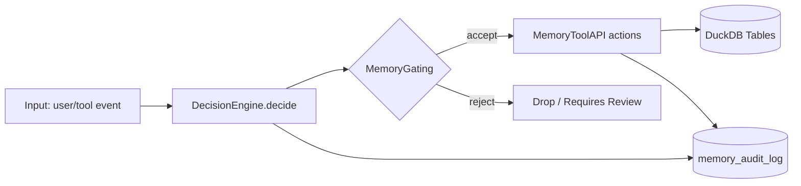
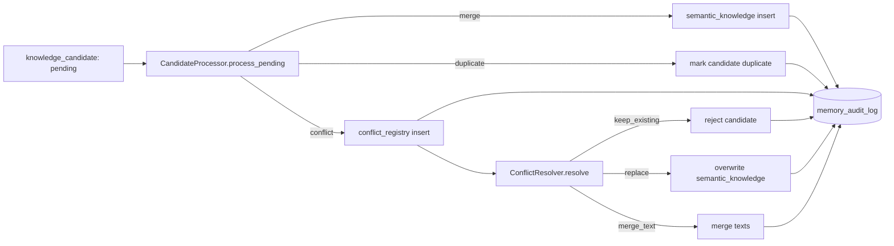

# Project Soul Anchor（AIME 使用手册）

本仓库提供一个基于 DuckDB 的本地“分层记忆系统”，并逐步引入 agentic（自主调用/门控/审计/候选升级/冲突处理/版本回滚）能力。

## 1. 系统概览

**分层记忆**

- L1 事件流（短期/可过期）：`context_stream`
- L2 稳定知识（可检索/可升级）：`semantic_knowledge`
- L3 核心契约（最高优先级约束）：`core_contract`

**Agentic 组件（Phase 3.x）**

- Tools：对外统一 Memory Tool API（会写审计）
- Decision：规则版决策输出 `MemoryDecision`
- Gating：写入门控（噪声过滤、重复检测、L3 禁止自动写）
- Audit：闭环执行器（Decide→Gate→Act→Audit）
- Candidates：候选合并/重复/冲突注册
- Conflicts：冲突解决（keep_existing/replace/merge_text）
- Versioning：知识快照与回滚

## 2. 流程图

### 2.1 闭环主流程（Decide → Gate → Act → Audit）



### 2.2 候选升级与冲突处理（Phase 3.2）



## 3. 环境与安装

**要求**

- macOS 或 Linux
- Python 3.11+

**创建虚拟环境**

```bash
python3.11 -m venv .venv
./.venv/bin/python -m pip install --upgrade pip
```

**安装依赖**

```bash
./.venv/bin/python -m pip install duckdb
```

**安装工具（可选）**

```bash
./.venv/bin/python -m pip install ruff
```

**字节内部源（可选）**

```bash
./.venv/bin/python -m pip install --index-url https://bytedpypi.byted.org/simple duckdb
```

## 4. 项目结构

- `src/soul_anchor/manager.py`：核心入口 `MemoryManager`
- `src/soul_anchor/db/schema.py`：schema 初始化（Phase 1/3.1/3.2/3.3）
- `src/soul_anchor/db/variant.py`：VARIANT 编码工具
- `src/soul_anchor/retrieval/`：检索与 context packet 组装
- `src/soul_anchor/agentic/`：agentic 模块（tools/decision/gating/audit/candidates/conflicts/versioning）
- `tests/`：测试用例（按 phase 拆分）

## 5. 快速开始

### 5.1 运行测试与静态检查

```bash
./.venv/bin/python -m unittest -v
./.venv/bin/ruff check .
```

### 5.2 连接数据库并自动建表

```python
from soul_anchor.manager import MemoryManager

mm = MemoryManager("aime_evolution.duckdb")
mm.connect()
```

首次 `connect()` 会自动执行 schema 初始化（见 `src/soul_anchor/db/schema.py`）。

## 6. 核心 API（Phase 1/2）

### 6.1 写入 L1 事件与检索 L1

```python
from soul_anchor.manager import MemoryManager

mm = MemoryManager(":memory:")
mm.connect()

event_id = mm.save_episode(
    {
        "session_id": "s1",
        "user_id": "u1",
        "event_type": "user_message",
        "content": "请记住我偏好简短提交，但必须带 detail。",
        "metadata": {"channel": "chat"},
        "embedding": [0.1, 0.2, 0.3],
    }
)

recent = mm.search_recent_context_advanced(
    session_id="s1",
    user_id="u1",
    query="提交",
    top_k=5,
)
```

### 6.2 写入 L2 知识与检索 L2

```python
from soul_anchor.manager import MemoryManager

mm = MemoryManager(":memory:")
mm.connect()

kid = mm.save_knowledge(
    {
        "user_id": "u1",
        "knowledge_type": "workflow",
        "title": "Commit Discipline",
        "canonical_text": "Every change should be committed with a short subject and a detailed body.",
        "keywords": "commit,discipline",
        "metadata": {"source": "user_preference"},
    }
)

hits = mm.search_knowledge(user_id="u1", query="commit", top_k=5)
```

### 6.3 构建 Context Packet（L3 → L2 → L1）

```python
packet = mm.build_context_packet(
    session_id="s1",
    user_id="u1",
    query="commit discipline",
    l1_limit=10,
    l2_limit=10,
    max_chars=2000,
    deduplicate=True,
)
```

返回结构：

- `core_contract`
- `semantic_knowledge`
- `recent_context`
- `metadata.total_chars`

## 7. Agentic 用法（Phase 3.x）

### 7.1 Memory Tool API（推荐入口，自动写审计）

```python
from soul_anchor.manager import MemoryManager
from soul_anchor.agentic.tools import MemoryToolAPI

mm = MemoryManager("aime_evolution.duckdb")
mm.connect()
tools = MemoryToolAPI(mm)

tools.save_episode(
    {
        "session_id": "s1",
        "user_id": "u1",
        "event_type": "user_message",
        "content": "请记住：每次改动后都要提交，并附带 detail。",
    }
)

ctx = tools.search_context(session_id="s1", user_id="u1", query="提交", top_k=5)
know = tools.search_knowledge(user_id="u1", query="commit", top_k=5)
```

所有 tool 调用都会写入 `memory_audit_log`。

### 7.2 最小闭环（Decide → Gate → Act → Audit）

```python
from soul_anchor.agentic.audit import AgenticLoopRunner, AuditRecorder, AuditVerifier
from soul_anchor.agentic.decision_engine import DecisionEngine
from soul_anchor.agentic.gating import MemoryGating
from soul_anchor.agentic.tools import MemoryToolAPI
from soul_anchor.manager import MemoryManager

mm = MemoryManager(":memory:")
mm.connect()

runner = AgenticLoopRunner(
    decision_engine=DecisionEngine(),
    gating=MemoryGating(mm),
    tools=MemoryToolAPI(mm),
    audit_recorder=AuditRecorder(mm),
    audit_verifier=AuditVerifier(),
)

result = runner.run_event(
    session_id="s1",
    user_id="u1",
    event_type="user_message",
    content="还是按上次那种方式来：先写测试再实现。",
)
```

`result` 包含：

- `decision`：结构化决策
- `executed_actions`：实际执行动作列表
- `audit_ids.decision_audit_id`：决策审计条目 id

### 7.3 候选处理（Phase 3.2）

候选知识写入 `knowledge_candidate`，再由处理器升级为：

- `merged`：写入 `semantic_knowledge`
- `duplicate`：标记为重复
- `conflict`：写入 `conflict_registry` 等待处理

```python
from soul_anchor.agentic.candidates import CandidateProcessor

processor = CandidateProcessor(mm)
stats = processor.process_pending(limit=50)
```

### 7.4 冲突解决（Phase 3.2）

```python
from soul_anchor.agentic.conflicts import ConflictResolver

resolver = ConflictResolver(mm)
resolver.resolve(conflict_id=123, strategy="merge_text")
```

策略：

- `keep_existing`
- `replace`
- `merge_text`

### 7.5 知识版本快照与回滚（Phase 3.3）

```python
from soul_anchor.agentic.versioning import KnowledgeVersioning

versioning = KnowledgeVersioning(mm)
snapshot_id = versioning.create_snapshot(knowledge_id=42, reason="before resolution")
versioning.rollback_to_snapshot(knowledge_id=42, snapshot_id=snapshot_id, reason="bad merge")
```

## 8. 运维与排障（Runbook）

### 8.1 数据库文件管理

- DuckDB 是单文件数据库：示例文件名 `aime_evolution.duckdb`
- 建议 DB 文件不要纳入 git（已在 `.gitignore` 中处理）

### 8.2 安全变更流程（推荐）

1. 对即将修改的 `semantic_knowledge` 行先打快照（Phase 3.3）
2. 执行候选合并/冲突解决
3. 如果效果不符合预期，使用 snapshot 回滚

### 8.3 可观测性（审计表）

核心可观测信号来自 `memory_audit_log`，可统计系统行为分布：

```sql
SELECT action_type, count(*) AS n
FROM memory_audit_log
GROUP BY action_type
ORDER BY n DESC;
```

### 8.4 常见问题

- 导入失败：确认从仓库根目录运行，且使用 `./.venv/bin/python`
- 测试失败：执行 `./.venv/bin/python -m unittest -v`，从第一个失败用例定位
- ruff 报错：执行 `./.venv/bin/ruff check .`
